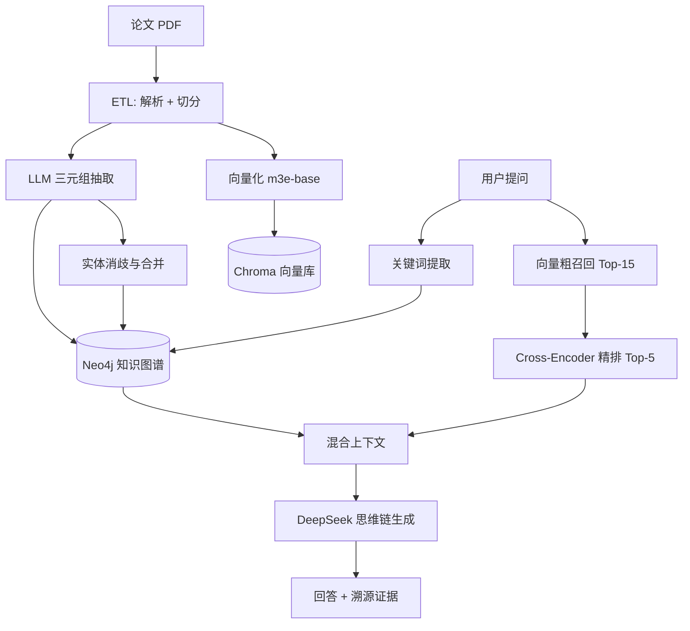

# CV-Mind · GraphRAG 科研文献知识引擎

基于 **GraphRAG** 的计算机视觉文献问答系统。把 CV 领域的科研论文同时组织成
**知识图谱**（结构化事实）与**向量索引**（非结构化细节），查询时两路召回、
交叉验证，再由 LLM 生成带溯源证据的回答。

> 本项目为本科毕业设计成果整理而来。核心命题：相比仅做向量检索的 Naive RAG，
> 引入实体关系图能否提升对"模型对比""机制原理"类问题的回答质量。

---

## 架构



**三路协同的检索流程：**

1. LLM 从问题中抽取核心实体关键词；
2. 在 Neo4j 上做模糊匹配，召回结构化三元组（实体—关系—实体）；
3. 向量库粗召回 Top-15，再用 `bge-reranker-base` 精排保留 Top-5；
4. 图谱事实与文献片段拼装为混合上下文，交给 LLM 按思维链约束生成答案。

---

## 目录结构

```
cv-mind-graphrag/
├── app.py                        # Streamlit 前端（对话 + 图谱可视化）
├── engine.py                     # GraphRAG 混合检索引擎
├── config.py                     # 集中配置：环境变量 / 路径 / 模型
├── evaluate_system.py            # GraphRAG vs Naive RAG 对照评测
├── scripts/
│   ├── build_vector_db.py        # 构建向量库
│   ├── build_knowledge_graph.py  # 抽取三元组写入图谱
│   ├── unify_entities.py         # 实体消歧与节点合并
│   └── reset_neo4j.py            # 清空图数据库
├── data/
│   ├── papers/                   # 论文 PDF（需自备，不入库）
│   └── chroma_db/                # 向量库持久化目录（不入库）
├── docs/
│   ├── AUDIT.md                  # 代码审查与脱敏记录
│   └── RELEASE_CHECKLIST.md      # 发布前检查清单
├── requirements.txt
├── .env.example
└── LICENSE
```

---

## 快速开始

从零到跑起来大约 20 分钟，时间基本都花在下载依赖和模型上。

### 前置条件

| 项目 | 要求 |
|---|---|
| Python | **3.10**（务必是这个版本，3.12+ 可能装不上对应的 torch / langchain 轮子） |
| 图数据库 | Neo4j 5.x，社区版即可 |
| 磁盘 | 约 5GB（依赖 + 模型 + 向量库） |
| 网络 | 需要能访问 HuggingFace（下模型）与 DeepSeek API，国内可能需要代理 |
| 内存 | 运行期约 2–3GB |

### 步骤 1｜安装依赖

```bash
python -m venv .venv
.venv\Scripts\activate           # Windows
# source .venv/bin/activate      # macOS / Linux

pip install -r requirements.txt
```

安装完成后可以先自检一下：

```bash
python -c "import config; print('配置模块 OK')"
```

### 步骤 2｜启动 Neo4j

从 [Neo4j 官网](https://neo4j.com/download/) 安装 Desktop 或社区版，
新建一个数据库并**记住你设置的密码**（第 4 步要用）。

确认服务已启动，浏览器访问 http://localhost:7474 能打开 Neo4j Browser 即可。

### 步骤 3｜放入论文语料

把自己下载的论文 PDF 放进 `data/papers/`：

```
data/papers/
├── Attention_Is_All_You_Need.pdf
├── ResNet.pdf
└── ...
```

> 💡 **第一次跑别放一百篇。**
> 先放 2–3 篇试通整个流程，确认没有报错后再一次性放开。
> 后面的图谱构建步骤会逐篇调用 LLM，百篇语料会消耗可观的 API 额度。

### 步骤 4｜填写凭据

```bash
cp .env.example .env
```

然后编辑 `.env`，至少要填这两项：

| 变量 | 填什么 |
|---|---|
| `DEEPSEEK_API_KEY` | 去 https://platform.deepseek.com/ 申请 |
| `NEO4J_PASSWORD` | 步骤 2 里你设置的密码 |

> `.env` 已被 `.gitignore` 屏蔽，不会被提交到仓库。

### 步骤 5｜构建索引

三步有先后依赖，**必须按顺序执行**：

```bash
# ① 解析 PDF → 切分 → 向量化，产物落在 data/chroma_db/
python scripts/build_vector_db.py

# ② 逐篇调用 LLM 抽取三元组，写入 Neo4j
python scripts/build_knowledge_graph.py

# ③ 实体消歧：把 ViT / Vision Transformer / ViT-B/16 这类别名合并成一个节点
python scripts/unify_entities.py
```

每步完成时都会打印明确的结束语，看到就说明成功了：

| 步骤 | 成功标志 |
|---|---|
| ① | `向量库构建完成！` |
| ② | `批量任务结束！成功处理 N/N 篇。` |
| ③ | `🎉 所有批次处理完成！实体消歧结束。` |

> 想从头再来一遍？`python scripts/reset_neo4j.py` 清空图数据库，
> 重新跑 ① 会覆盖旧的向量库。

### 步骤 6｜启动

```bash
streamlit run app.py
```

看到这段输出就说明起来了：

```
You can now view your Streamlit app in your browser.
Local URL: http://localhost:8501
```

用浏览器打开 http://localhost:8501 即可提问。首次启动会加载嵌入与重排模型，
**需要等 1–2 分钟**，日志出现 `>>> GraphRAG 引擎初始化就绪 <<<` 就绪了。

提问后：

- 左侧栏渲染本次召回涉及的实体关系网络；
- 回答下方可展开「溯源证据」，分别列出图谱事实与文献原文片段。

---

## 常见问题

| 现象 | 原因与解法 |
|---|---|
| `未找到向量库` | 先跑步骤 5 的 ①，`data/chroma_db/` 得有内容 |
| `未找到 DEEPSEEK_API_KEY` | `.env` 没建或没填，回去看步骤 4 |
| `未找到 NEO4J_PASSWORD` | 同上；注意 Neo4j 密码不是默认的 `neo4j` |
| 连不上 Neo4j | 确认 Neo4j 服务已启动，且端口是 7687；没改过就不用动 `NEO4J_URI` |
| 首次启动卡住很久 | 正在从 HuggingFace 下载模型（约 1GB），耐心等或配好代理 |
| 装依赖时编译失败 | 八成是 Python 版本不对，确认是 **3.10** |
| 回答内容跟问题无关 | 向量库和引擎用的嵌入模型不一致，删掉 `data/chroma_db/` 重建 |
| 内存吃满 | 属正常，嵌入+重排模型常驻约 2–3GB |

---

## 配置项

全部配置集中在 `config.py`，通过环境变量覆盖，无需改动代码。

| 变量 | 默认值 | 说明 |
|---|---|---|
| `DEEPSEEK_API_KEY` | — | **必填** |
| `NEO4J_URI` | `bolt://localhost:7687` | |
| `NEO4J_USER` | `neo4j` | |
| `NEO4J_PASSWORD` | — | **必填** |
| `LLM_MODEL` | `deepseek-chat` | |
| `LLM_BASE_URL` | `https://api.deepseek.com` | 换成任意 OpenAI 兼容端点即可切换模型 |
| `EMBEDDING_MODEL` | `moka-ai/m3e-base` | 改动后**必须重建向量库** |
| `RERANKER_MODEL` | `BAAI/bge-reranker-base` | |
| `RECALL_TOP_K` | `15` | 向量粗召回条数 |
| `RERANK_TOP_K` | `5` | 精排后保留条数 |
| `GRAPH_RELATION_LIMIT` | `5` | 每个关键词的图谱召回上限 |

---

## 评测

```bash
python evaluate_system.py
```

用 20 道分层测试题（7 道基础事实 / 7 道对比分析 / 6 道深度原理）分别考察
GraphRAG 与 Naive RAG，由 LLM 裁判按 0-10 分打分，输出：

- `outputs/evaluation_report.xlsx` — 逐题得分与耗时明细
- `outputs/evaluation_dashboard.png` — 三合一可视化面板

---

## 本体设计

图谱采用轻量属性图 Schema，刻意限制类型空间以抑制 LLM 抽取时的幻觉：

**实体类型**：`Model` · `Dataset` · `Metric` · `Task`

**关系类型**：`outperforms` · `evaluated_on` · `has_metric` · `uses_method`

自动抽取难免产生别名分裂（`ViT` / `Vision Transformer` / `ViT-B/16` 会被建为三个节点），
`scripts/unify_entities.py` 借助 LLM 归并同义词并把出入边转移到主词节点。

---

## 已知限制

- **实体消歧仅覆盖 `Model` 类**，`Dataset` / `Metric` / `Task` 尚未处理。
- **依赖 LangChain 1.x 生态**，版本敏感，请整体升级而非单独升级某个包。
- **检索质量依赖语料规模**，语料少于数十篇时图谱召回效果有限。
- 引擎启动时会常驻加载嵌入与重排模型，**内存占用约 2-3GB**。

---

## License

[MIT](LICENSE)

论文版权归原作者所有，本仓库不包含任何论文原文。
